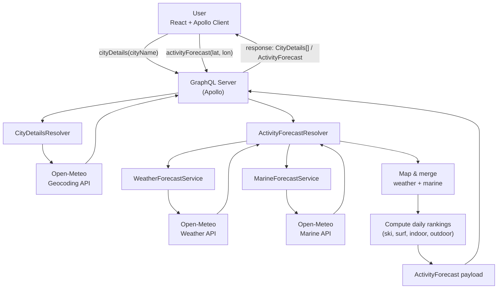

# Activity Forecast App

## Deployed URLs
- Frontend: [https://activityforecast.gerharduscronje.co.za](https://activityforecast.gerharduscronje.co.za)
- GraphQL API: [https://activityforecastapi.gerharduscronje.co.za](https://activityforecastapi.gerharduscronje.co.za)

## Overview
This repository contains a minimal full‑stack application:
- Backend: Node.js GraphQL API (Apollo Server) that aggregates Open‑Meteo services and exposes two queries: cityDetails and activityForecast.
- Frontend: React + Apollo Client app that lets a user search for cities and view a 7‑day activity suitability forecast (ski, surf, indoor/outdoor sightseeing).

## Architecture: Functional and Technical Choices

### Data flow

- Frontend searches cities: Apollo Client calls `cityDetails(cityName)` → resolver proxies to Open‑Meteo Geocoding and returns `CityDetails[]`.
- User selects a city: coordinates sent to `activityForecast(latitude, longitude)`.
- The activity forecast service then uses the longitude and latitude to retrieve both the weather forecast and the marine forecast at the same time (marine forecast is for surfing and determining if we are in a coastal city).
- Once retrieved, the returned data is transformed into a cohesive response containing both marine and weather data.
- Activity service computes daily activity rankings (ski/surf/indoor/outdoor) and merges units + values into a single payload.
- GraphQL returns the combined forecast → frontend renders the 7‑day view.

### Functional
- Activity ranking logic (per day): Scores scale primarily with max wind speed and temperature, with clear “impossible” guards. Rationale was documented inline in `ActivityForecastService`.
  - Skiing
    - Impossible when: temperature > -1°C (no snow), temperature < -21°C (too cold), wind ≥ 60 km/h (unsafe), rain > 15 mm, or location is coastal (unlikely to ski).
    - Scoring: ideal temperature window [-6, -1] grants 5 points; colder than -6 reduces score proportionally ((temperature + 21) / 3) but never negative. Wind adds points the calmer it is: (60 − windSpeedMax) / 10, capped at +5.
  - Surfing
    - Impossible when: temperature < 5°C (too cold), not coastal, rain > 15 mm, wind > 30 km/h, waveHeightMax < 1 m, or wavePeriodMax < 6 s.
    - Scoring: warmer temps improve score, with 25°C+ giving full 5 points; below that score ≈ temperature/5. Calm wind adds up to 5; else penalize roughly with (-temperature + 30)/4.
  - Outdoor sightseeing
    - Impossible when: rain > 10 mm, temperature > 40°C, wind > 40 km/h, or skies not clear (based on `weatherCode`, accepts ☀️, 🌤️, ⛅).
    - Scoring: ideal temperature ∈ [22, 28] gives +5. Below ideal: penalize ~1 point per 7°C ((temperature − 11)/7, non‑negative). Above ideal: penalize ~1 point per 3°C ((−temperature + 43)/3). Wind adds up to +5 when < 15 km/h; else penalize with (−windSpeedMax + 40)/5.
  - Indoor sightseeing
    - Always possible. Constant mid score (6) to reflect a safe, average choice regardless of conditions.

- GraphQL Schema: Fetching a weather forecast requires a longitude and latitude. This can be found by fetching a city by name first. The Open Meteo api will fuzzy match on the search string, allowing us to retrieve a longitude and latitude from a city to pass on to the activity generator.

### Technical
- API boundary: GraphQL provides a strongly‑typed, single endpoint with a compact schema surface (two queries). Internal/external TS types mirror the schema for safety and clear mapping from upstream APIs.
- Services: Dedicated service modules fetch weather/marine data and compute activity rankings. Mapping converts external snake_case to internal camelCase.
- Frontend state: Lightweight React composition; Apollo Client handles networking and caching. Components are small and focused (search bar, results list, forecast panel).
- Styling: Single CSS file with design tokens and utility classes for a tidy baseline; easily movable to CSS modules or a design system later.
- DX & deploy: Dockerfiles for frontend/backend and Compose files for local all‑in‑one and backend‑only dev (Apollo Explorer). Frontend runs on 4001, backend on 4000.

### Deployment

I just stuck this onto my old laptop that is always on and connected through a Cloudflare tunnel and ran it.
I then expose the correct port and point it to my hostname in the Cloudflare dashboard to create DNS records for me for the new subdomain.

## Running Locally with Docker

`docker compose -f docker-compose-dev.yml up --build`

## Omissions & Trade‑offs
- No rate limiting: If someone spams requests we will go over open meteo free tier.
- Low test coverage: Only tested unpredictable paths with local integration tests.
- No server side caching; all data originates from Open‑Meteo every time.
- Limited error/edge‑case handling to save dev time, this would need to be adressed first.
- Minimal UI: Emphasis is on clean data flow and types.

## How AI assisted in the process

### Planning
I used google's built in search AI to look up ideal conditions for skiing and surfing.

### Backend
I didn't use much AI in the backend build. I used cursor to write a single function that converts weather codes into appropriate emojis.

I valued building a greater understanding of what the backend portion did over using AI to produce it faster. This let me build a solid foundation, because, like I will get to later, this made it really easy to build the frontend using mostly AI.

### Frontend
Having built a solid backend foundation allowed me to very easily use AI via cursor to put together most of the frontend based on a neatly structured backend API.

### Documentation
I used Cursor to write the first draft of all the documentation before editing it myself afterwards.

### CI
I used AI to put together the dockerfiles and docker compose files based on the package.json files

## Extra
- Personal github: [https://github.com/GerhardusC](https://activityforecast.gerharduscronje.co.za)
